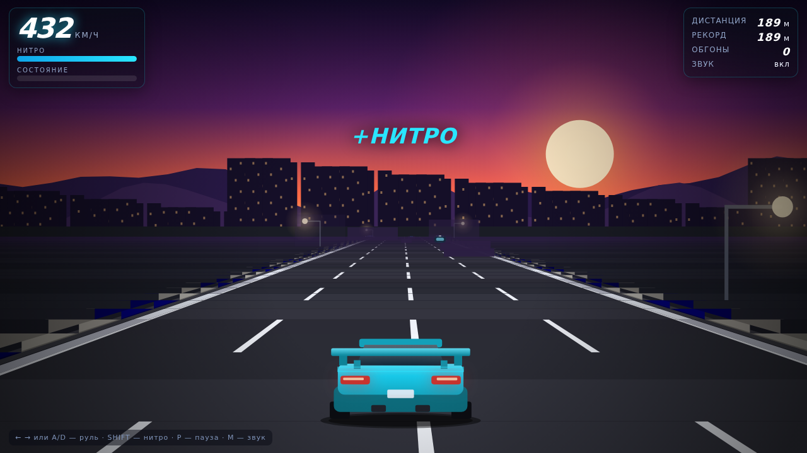

# my-project

Краткое описание проекта — одна-две строки о том, что здесь происходит.

## Что внутри

**Нитро-Шоссе** — браузерная аркадная гонка в духе шоссейных режимов Asphalt:
псевдо-3D дорога, закат, трафик, отбойники, нитро и счёт обгонов.
Один файл `index.html`, без библиотек и сборки — вся графика процедурная.

Открыть: `index.html` или `python3 -m http.server 8000` → http://localhost:8000

Управление: `←` `→` руль, `SHIFT` нитро, `P` пауза, `M` звук.
Подробности — в [GAME.md](GAME.md).



## Возможности

- Псевдо-3D шоссе с поворотами, спусками и подъёмами
- Трафик из 12 машин с ИИ: перестроения, торможение, столкновения
- Нитро с баллонами на дороге и бонусом за проезд «вплотную»
- Урон, авария, рекорд дистанции
- Закатный фон: горы, город с окнами, фонари
- Адаптивное качество и тач-управление

## Установка

```bash
git clone https://github.com/Mihail007p/my-project.git
cd my-project
```

## Использование

```bash
# добавьте сюда команды запуска
```

## Структура проекта

```
.
├── index.html        # игра «Нитро-Шоссе» (один файл, без зависимостей)
├── GAME.md           # описание игры, механик и архитектуры
├── tests/            # автотесты: логика, сценарии, скриншоты
├── .github/          # шаблоны issues/PR и CI
├── docs/             # документация
├── .editorconfig     # единый стиль отступов
├── .gitignore        # что не коммитим
├── CHANGELOG.md      # история изменений
├── CONTRIBUTING.md   # как контрибьютить
└── LICENSE           # MIT
```

## Разработка

```bash
node tests/headless-test.js      # симуляция без DOM
node tests/scenario-test.js      # сценарии: удары, обгоны, барьер, трафик, нитро
node tests/screenshot-test.js    # прогон в headless Chrome + скриншоты (нужен puppeteer)
```

## Лицензия

MIT — см. [LICENSE](LICENSE).
