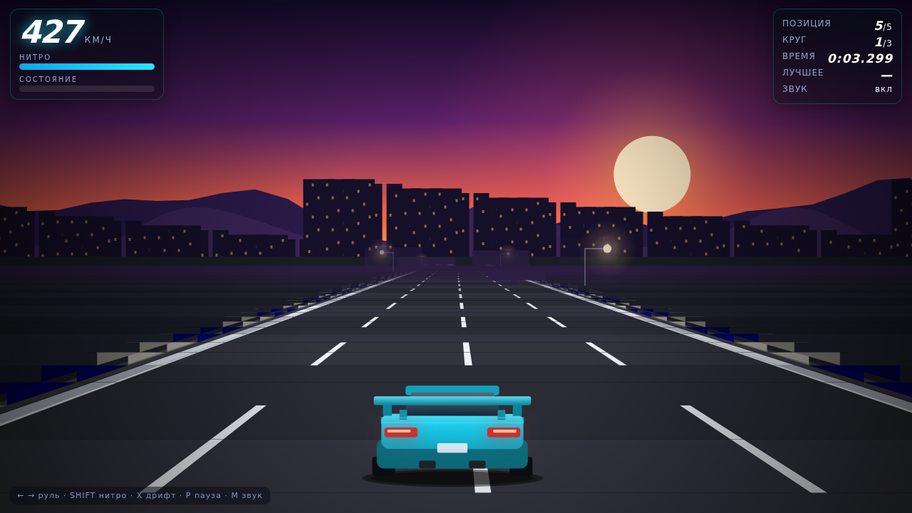

# Нитро-Шоссе → Городское шоссе (WebGL)

Игра переписывается с нуля: вместо 2D-аркады — настоящий трёхмерный мир (WebGL).
Сейчас готов **мир**: городское шоссе длиной 8.8 км с тоннелем, путепроводами,
знаками, фонарями, шумозащитными экранами и городом вокруг — ~3 600 зданий.

* Играть: `index.html` (открыть в браузере) или `make serve` → http://localhost:8000
* Подробности мира, управление и проверки: [`docs/WORLD.md`](docs/WORLD.md)
* Предыдущая версия игры (2D-аркада) — в истории коммитов, коммит `b32889b`.

Краткое описание проекта — одна-две строки о том, что здесь происходит.

## Что внутри

**Нитро-Шоссе** — браузерная аркадная гонка в духе шоссейных режимов Asphalt:
псевдо-3D дорога, закат, трафик, отбойники, трамплины, дрифт и гонка
на 3 круга с четырьмя соперниками. Один файл `index.html`, без библиотек
и сборки — вся графика процедурная.

Открыть: `index.html` или `python3 -m http.server 8000` → http://localhost:8000

Управление: `←` `→` руль, `SHIFT` нитро, `X` дрифт, `P` пауза, `M` звук.
Подробности — в [GAME.md](GAME.md).



## Возможности

- Псевдо-3D шоссе с поворотами, спусками, подъёмами и трамплинами
- Гонка: 3 круга, 4 соперника, позиции, отсчёт старта, лучший результат
- Трафик с ИИ: перестроения, торможение, столкновения
- Дрифт: занос, следы шин, дым, очки и бонус нитро
- Полёты с трамплина: в воздухе руль и барьеры не действуют
- Нитро: баллоны на дороге, бонус за проезд «вплотную», награда за дрифт
- Урон, авария, экраны финиша и перезапуска
- Закатный фон: горы, город с окнами, фонари
- Адаптивное качество и тач-управление

## Установка

```bash
git clone https://github.com/Mihail007p/my-project.git
cd my-project
```

## Использование

```bash
# добавьте сюда команды запуска
```

## Структура проекта

```
.
├── index.html        # игра «Нитро-Шоссе» (один файл, без зависимостей)
├── GAME.md           # описание игры, механик и архитектуры
├── Makefile          # make serve / make test / make shots
├── tests/            # автотесты: логика, сценарии, скриншоты
├── .github/          # шаблоны issues/PR и CI
├── docs/             # документация, план (ROADMAP.md), скриншоты
├── .editorconfig     # единый стиль отступов
├── .gitignore        # что не коммитим
├── CHANGELOG.md      # история изменений
├── CONTRIBUTING.md   # как контрибьютить
└── LICENSE           # MIT
```

## Разработка

```bash
make serve     # игра на http://localhost:8000
make test      # все автотесты (без браузера)
make shots     # скриншоты в headless Chrome (нужен puppeteer)
make help      # список команд
```

Тесты по отдельности:

```bash
node tests/headless-test.js      # симуляция без DOM
node tests/scenario-test.js      # сценарии: удары, обгоны, барьер, трафик, нитро
node tests/race-test.js          # гонка: соперники, круги, трамплин, дрифт, финиш
node tests/screenshot-test.js    # прогон в headless Chrome + скриншоты
```

Состояние проекта и план развития — в [docs/ROADMAP.md](docs/ROADMAP.md).

## Лицензия

MIT — см. [LICENSE](LICENSE).
